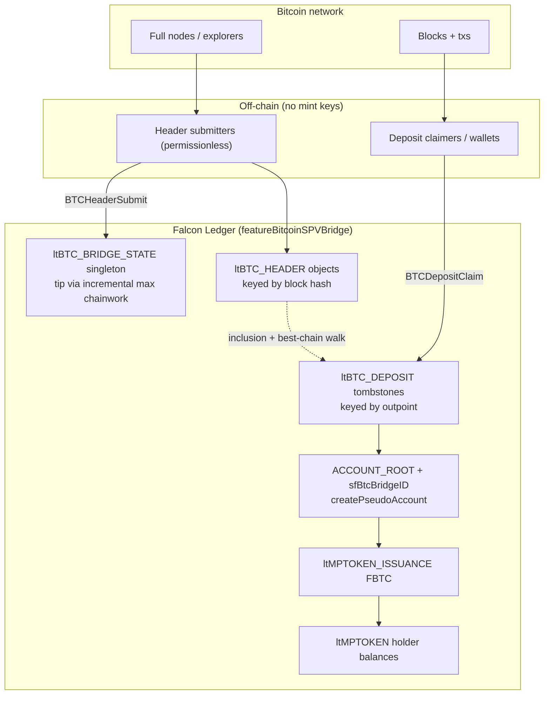
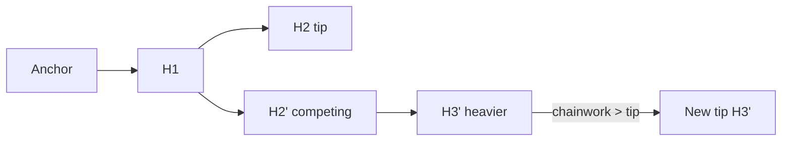

# Bitcoin SPV Payment-Attestation Mint for Falcon Ledger

| Field | Value |
|-------|-------|
| **Document title** | Bitcoin SPV Payment-Attestation Mint (Light-Client Path) for Falcon Ledger |
| **Author** | Falcon Ledger Protocol Engineering |
| **Status** | Draft (rev 2.1 — mint helpers + incremental tip) |
| **Date** | 2026-07-29 |
| **Branch** | `feature/btc-spv-light-client` (do not land on main testnet / 1001 configs) |
| **Amendment name** | `BitcoinSPVBridge` → `featureBitcoinSPVBridge` |
| **Product label (MVP)** | **SPV payment attestation mint (testnet research)** — not a custody bridge |
| **Scope phase** | Bitcoin SPV header tracking + deposit-side mint only |
| **Codebase** | `/home/droid/FalconLedger` |

---

## Overview

Falcon Ledger currently bridges value with a **custodial multi-sig relay** path (ETH Sepolia → QUC via `scripts/bridge-deposit-relay.py` and `contracts/FalconCollateralLock.sol`). That path is operationally useful but opposite Falcon’s long-term model: **protocol-controlled, bonded validators, no company issuer keys**.

This document specifies a **Bitcoin SPV light-client path**: Falcon tracks a verified Bitcoin header chain on-ledger, accepts **permissionless** deposit proofs (Bitcoin transaction + Merkle inclusion path + anchor header), and **mints protocol-controlled FBTC (MPT)** only after a confirmation-depth policy is satisfied and the Bitcoin outpoint has never been used for mint.

### Honest economic label (MVP)

**MVP is an SPV payment attestation mint, not a trustless custody bridge.**

- On-ledger logic proves a Bitcoin payment of amount `V` to a configured watch script, with a Falcon `AccountID` bound via OP_RETURN, included in a header that is ≥ `N` deep on Falcon’s best-work Bitcoin tip.
- It does **not** enforce a covenant lock on the BTC after payment. BTC at the watch address can move while FBTC remains transferable.
- FBTC is therefore **not redeemable for BTC** in this phase. There is **no burn/peg-out**, no withdraw RPC, and **no mainnet enablement** until a separate lock-script + redeem design exists.
- Isolated-testnet use only until further notice; hard **mint caps** are in MVP. `sfBtcPaused` is **reserved** (checked but not operator-toggleable until a follow-on setter).

All new ledger entry types, SFields, transaction types, and mint logic are **additive** and gated by amendment `BitcoinSPVBridge` (`VoteBehavior::DefaultNo`, `Supported::Yes`). When disabled, every new transaction returns `temDISABLED` (same pattern as `ValidatorRegister::preflight` in `src/libxrpl/tx/transactors/qxrp/ValidatorRegister.cpp`). Existing testnet behaviour, custodial relays, issuer keys, lock contracts, and wallet flows are **untouched**.

The first operational target is a **temporary isolated testnet** on spare servers (new `network_id` **1101**, feature forced on via **`[features]`** at genesis) so the light-client path can be proven without risk to Network ID 1001 or mainnet ceremony assets.

---

## Background & Motivation

### Current state

| Path | Mechanism | Trust | Code |
|------|-----------|-------|------|
| ETH→Falcon QUC (live testnet) | Lock contract event → relay mints IOU | Custodial / multi-sig issuer | `docs/MAINNET_BRIDGE.md`, `scripts/bridge-deposit-relay.py`, `contracts/FalconCollateralLock.sol` |
| XRPL XChainBridge (upstream) | Witness attestations on door accounts | Witness set | `src/libxrpl/tx/transactors/bridge/XChainBridge.cpp`, `ltBRIDGE` / `ltXCHAIN_OWNED_CLAIM_ID` |
| Falcon PoP / treasury | Keyless protocol treasury + bonded validators | Protocol rules | `ltVALIDATOR_BOND`, `ltREWARD_EPOCH`, `featureProofOfParticipation` |

The custodial bridge is interim (`bridge-deposit-relay.py`: “Production: replace with validator-attested CollateralBridge tx type”). XChain is **attestation-based**, not SPV; we **must not** overload `ltBRIDGE` / XChain for Bitcoin headers.

### Pain points

1. **Issuer keys** create minting and operational risk (`docs/MAINNET_BRIDGE.md` mainnet gaps).
2. **Relays** are off-chain SPOFs and conflict with Falcon’s keyless treasury philosophy (`QXRPConstants.h`: treasury seed is public-by-design; emission is protocol-only — but treasury is a *normal* account ID, **not** a `createPseudoAccount` pseudo-account).
3. **No path** yet for Bitcoin-collateral *attestation* that is cryptographically verified on Falcon without trusted mint signers.

### Why SPV first

Bitcoin’s headers-first SPV model is mature and auditably simple for **deposit-side** proofs with conservative confirmation depth. Withdraw/burn (Falcon→BTC) has different requirements and is **out of MVP**; mainnet is **blocked** until that design exists.

---

## Goals & Non-Goals

### Goals

1. Long-term architecture for a Bitcoin SPV light client on Falcon ledger state.
2. Exact new ledger objects and transaction types, with invariants.
3. Core logic amendment-gated; main testnet binary may ship code with feature off.
4. Isolated temporary testnet plan for header + deposit + mint end-to-end.
5. Inflation-safe, double-mint-proof FBTC issuance under **true protocol pseudo-account** control.
6. Safe handling of Bitcoin reorgs up to the configured confirmation depth.
7. Implementation plan grounded in real registration surfaces and helpers.

### Non-Goals (this phase)

- Ethereum or BNB light clients.
- Falcon→Bitcoin withdraw / burn / peg-out / redeem RPC (any surface).
- Marketing FBTC as fully BTC-backed custody on public networks.
- Full Bitcoin script interpreter beyond payment + OP_RETURN extraction.
- Modifying the existing custodial ETH/QUC bridge or its relays.
- Storing the entire historical Bitcoin chain forever without a prune design (required before public nets).
- Interactive fraud proofs / challenge games.
- Overloading `featureXChainBridge` / `ltBRIDGE` for BTC.

### Safety rules (non-negotiable)

- Do **not** change current main testnet behaviour or custodial relays.
- All new functionality behind `featureBitcoinSPVBridge`.
- Work on branch `feature/btc-spv-light-client`.
- Existing issuer keys, lock contracts, and relay processes continue unchanged.
- New account / tx / object types are **additive only**.
- **Never** enable this feature in `cfg/falcon-validator.cfg` / network **1001** UNL configs used by the live testnet.
- **Never** enable on mainnet until lock + redeem design is approved.

---

## Key Decisions

| # | Decision | Rationale |
|---|----------|-----------|
| K1 | **Separate subsystem** from XChainBridge and custodial ETH bridge | Different trust model; avoid forking risk on shared types. XChain is structural reference only. |
| K2 | **On-ledger header chain** with **best-work tip** | Headers may extend **any known** header; tip = max `sfBtcChainWork` among stored headers. |
| K3 | **Permissionless header submission** (fee-paid; batch limit) | Spam controlled by fees + caps; bonded relayers deferred (Alt B) before public enable. |
| K4 | **Confirmation depth `N` before mint** | State stores `sfBtcMinConfirmations`; runtime value = `max(state, floor(chainId))`. Testnet floors: regtest 1, testnet3/signet 6; mainnet floor 12 (mainnet enable still blocked by product gate). |
| K5 | **Double-mint key = Bitcoin outpoint** (`txid` internal + `vout`) → `ltBTC_DEPOSIT` | Unique permanent tombstone. |
| K6 | **FBTC as MPT from true pseudo-account** via `createPseudoAccount(..., sfBtcBridgeID)` | Mirrors Vault/AMM (`VaultCreate.cpp`); **not** public seed / treasury-style key-derivable account. |
| K7 | **Single deposit encoding (normative)** | ≥1 output matching `sfBtcWatchScriptHash` (value `V`) **and** exactly one OP_RETURN `FALC \|\| AccountID20`. |
| K8 | **No mint reversal after success** | Residual reorg risk bounded by `N` + Bitcoin PoW cost. |
| K9 | **Amendment `BitcoinSPVBridge`, DefaultNo** | Ships dark; isolated testnet enables via **`[features]`**. |
| K10 | **MVP = headers + one deposit claim + mint** under regtest + isolated Falcon net | Smallest full verification path. |
| K11 | **Header storage: one SLE per header + singleton tip** | Simple; prune design required before public nets; deposits never deleted. |
| K12 | **Chain-scoped Bitcoin consensus subset** | Regtest MVP: hash ≤ target(nBits) + link + 80-byte parse. Testnet3/mainnet: full retarget before enable. |
| K13 | **Product label** | “SPV payment attestation mint (testnet)”; mint caps in MVP; `sfBtcPaused` **reserved** (no MVP setter); mainnet blocked until covenant lock + redeem. |
| K14 | **Activate auth** | Isolated SPV net (`network_id == 1101`) or unit harness: first-wins permissionless. Public nets: **genesis-injected state only** or future gov tx — no permissionless activate. |
| K15 | **Tx type codes locked** | `ttBTC_BRIDGE_ACTIVATE = 98`, `ttBTC_HEADER_SUBMIT = 99`, `ttBTC_DEPOSIT_CLAIM = 110`. **Not 102** (`ttUNL_MODIFY`). |
| K16 | **Chainwork as UINT256** | Fits cumulative work encoding; simpler than VL. |
| K17 | **Destination must pre-exist**; **MVP: claimer == destination**; destination pays MPToken reserve | No `CreateAcct` on claim. Guard `authorizeMPToken` with `!exists(keylet::mptoken(...))` (VaultDeposit pattern). Claimer pays **only** the tx fee; destination’s XRP balance / ownerCount must cover MPT reserve on first hold. Dust: regtest/testnet **1 sat**; mainnet design later **546** sats. |
| K18 | **Config section is `[features]`** | Matches `cfg/standalone.cfg`, `cfg/falcon-validator.cfg`, `docs/new-testnet/*/xrpld.cfg`. |
| K19 | **Covenant-only BTC lock for mainnet; no keys held by anyone** | Correctness over speed. **Forbidden:** company keys, validator/guardian multisig custody, custodial relays as long-term peg. **Required for mainnet 2-way peg:** Bitcoin covenant (script rules control spends) + Falcon burn path. MVP remains mint-only attestation until covenant design is ready. Federated vault is **not** an interim mainnet path. |
| K20 | **No pause guardians / no human pause authority** | Pure protocol. `sfBtcPaused` stays reserved/inert (or unused); no bonded pause set, no operator freeze of mint. Emergency response = fix protocol / amendment / isolated-net wipe — not a privileged pause key. |
| K21 | **Auto-scale fee for `BTCHeaderSubmit` by batch size** | Required fee grows with number of headers in the tx (base + per-header). Spammers pay more for large batches; no special operator fee path. Exact formula fixed in implementation (e.g. `baseFee + n * perHeaderFee` in drops). |
| K22 | **Design height→hash index early** | Spec `ltBTC_HEIGHT` (or equivalent keylet: chainId + height → best-work header hash at that height on the current tip lineage) in the object model now, even if MVP regtest PoW does not need retarget walks. Implement storage on `BTCHeaderSubmit` when headers are accepted; full retarget uses it later. Avoids a redesign when enabling mainnet-grade difficulty. |
| K23 | **Mainnet BTC lock/redeem = BitVM-class** | No keys; covenant power via BitVM-style challenge/fraud-proof constructions (not CTV-only, not federated multisig). Correctness over speed. |
| K24 | **BitVM peg-out prototype on same branch** | Falcon `BTCBridgeBurn` (111) + `BTCWithdrawFinalize` (112) + `ltBTC_WITHDRAWAL`; Bitcoin vault CSV+hashlock tools under `scripts/btc-spv/bitvm/`. E2E-testable on regtest. Full SNARK BitVM trees remain future hardening. |

---

## Architecture Overview

### High-level components



### How Bitcoin headers are tracked

1. **Genesis anchor.** `ltBTC_BRIDGE_STATE` holds chain ID, anchor hash/height/work, min confirmations, mint cap, pause flag, watch script hash, FBTC issuance ID, tip fields, total minted.

2. **Extension (any parent, not tip-only).**  
   A header is acceptable if:
   - 80 bytes parse cleanly;
   - PoW / difficulty rules for `sfBtcChainId` pass (see Bitcoin consensus subset);
   - `prev_hash` equals **any already-stored** `ltBTC_HEADER`’s block hash **or** the anchor hash (if parent is the anchor and anchor header was stored);
   - the header’s own hash is not already stored (idempotent no-op if already present).

3. **Tip selection (Bitcoin best-work) — incremental online algorithm.**  
   There is **no** ledger index to enumerate all `ltBTC_HEADER` objects; a full SHAMap scan in a transactor is **not** acceptable.

   **Online rule (O(1) per newly inserted header):**
   ```
   for each newly inserted header H:   // skip headers already present (idempotent)
     if H.chainWork > tip.chainWork
        || (H.chainWork == tip.chainWork
            && (H.height > tip.height
                || (H.height == tip.height && H.blockHash > tip.blockHash))):
       tip = H
   ```
   Because `workFromBits(nBits) > 0` along any valid path, chainwork **strictly increases** on every extension, so the heaviest tip is always reached by comparing only **newly inserted** headers against the current tip (children of a lighter fork cannot overtake unless their cumulative work exceeds tip — which is exactly when the incremental compare promotes them).

   **Invariant (not the online algorithm):** after every successful submit, no stored header has chainwork strictly greater than tip’s (or equal work with a better height/hash tie-break). Unit tests with tiny header sets may scan all headers to check this; production `doApply` must use the incremental rule only.

4. **Fork / reorg.**  
   A competing branch is built by submitting headers whose `prev` is a known ancestor (not necessarily current tip). When a newly inserted header’s cumulative work exceeds (or ties with height/hash rules above) current tip work, tip moves. Orphaned headers remain stored until prune (post-MVP).

5. **Pruning (post-MVP, required before public nets).**  
   Never delete a header referenced by any `ltBTC_DEPOSIT.sfBtcBlockHash`, nor any header within `N + kBTC_PRUNE_SAFETY` of tip, nor anchor/checkpoints. Deposits store block hash + height + merkle root denormalized so audit survives prune of *unreferenced* deep headers.



### HeaderSubmit algorithm (normative)

```
BTCHeaderSubmit(headers[1..k], k <= kBTC_MAX_HEADERS_PER_TX):
  require feature + state exists + !paused
  tipHash, tipHeight, tipWork = state.sfBtcTipHash/Height/Work   // load once
  for each raw 80-byte header H in order:
    parse fields; reject if len != 80
    blockHash = doubleSHA256(H)   // Bitcoin internal byte order
    if ltBTC_HEADER[blockHash] exists:
      continue  // idempotent skip — do not re-compare tip
    parentHash = H.prev_block
    parent = loadHeader(parentHash) OR (parentHash == anchorHash && anchor stored)
    if !parent: return tecNO_ENTRY   // cannot extend unknown parent
    height = parent.height + 1
    verifyConsensus(chainId, H, parent, height)  // PoW + difficulty subset
    work = parent.chainWork + workFromBits(H.nBits)
    insert ltBTC_HEADER{blockHash, height, H, work, prev, merkleRoot}
    // Incremental tip update (O(1) per new header — do NOT scan all headers):
    if work > tipWork
       || (work == tipWork && (height > tipHeight
            || (height == tipHeight && blockHash > tipHash))):
      tipHash, tipHeight, tipWork = blockHash, height, work
  write singleton tip fields from tipHash/tipHeight/tipWork
```

**Adversarial tests (required):**

| Test | Expected |
|------|----------|
| Extend tip | tip advances |
| Extend ancestor (fork) with **less** work | headers stored; tip unchanged |
| Extend ancestor with **more** work | tip reorgs to new branch |
| Batch starts at fork point, walks forward | tip updates if heavier |
| Claim after reorg: old branch header | fail not-on-best-chain |
| Claim after reorg: tx re-included on new tip | success with new proof |
| Reorg after successful mint | FBTC intact; deposit SLE remains |

### Bitcoin consensus subset (implementable)

#### Shared for all chain IDs

| Check | Rule |
|-------|------|
| Size | Exactly 80 bytes |
| Hash | `blockHash = SHA256(SHA256(header))` (internal order) |
| PoW | Interpret `nBits` → target; require `blockHash ≤ target` (as 256-bit integers, Bitcoin convention) |
| Link | `prev` known (stored header or anchor) |
| Timestamp (MVP hard) | `timestamp ≤ parent.timestamp + kBTC_MAX_FUTURE_SKEW` is **not** the Bitcoin rule; enforce: `timestamp ≤ Falcon parent close time + 2 hours` (wall-clock analog of Bitcoin’s future-block limit using ledger close time), and `timestamp > median of last min(11, height-anchor) ancestors` when those headers exist (MTP soft rule). If walk for MTP incomplete (missing ancestors in window), **reject** header (`tecNO_ENTRY`) so submitter must fill ancestors first. |
| Duplicate | Already-stored hash: skip (success) |

#### Per `sfBtcChainId`

| Chain | ID | Difficulty / retarget | MVP status |
|-------|-----|----------------------|------------|
| **Regtest** | 3 | No retarget. Accept any nBits that yields a target the hash meets (typically `0x207fffff`). Anchor nBits stored; children may use same. | **MVP primary** |
| **Signet** | 2 | Treat like testnet3 for retarget once enabled; may start as “hash ≤ target only” behind test flag. | Optional after regtest green |
| **Testnet3** | 1 | Full Bitcoin difficulty: retarget every **2016** blocks; timespan clamp `[span/4, span*4]` with `span = 2 weeks`; **special min-difficulty rule** if timestamp > previous + 20 minutes allow min-diff, next block returns to expected. Requires header at `height - 2016` on ledger for retarget heights. | Required before public testnet3 experiments |
| **Mainnet** | 0 | Full retarget (no min-diff special). Same 2016 period / clamp. | **Blocked** for feature enable until redeem design + audit |

**Retarget dependency:** For chains with retarget, accepting height `H` where `H % 2016 == 0` requires the header at height `H - 2016` already on ledger (walk or height index). **MVP regtest does not implement retarget.** Unit fixtures for mainnet block 0, first retarget (block 2016), and a known testnet3 min-diff case ship in PR3 crypto tests but retarget code is compiled and only executed when `chainId ∈ {0,1,2}`.

**Reference:** Bitcoin Core consensus (`pow.cpp` difficulty, BIP34/BIP66/BIP65 not required for header-only). Fixtures compared against `bitcoind` `getblockheader` outputs.

#### Chainwork

```
workFromBits(nBits) = 2^256 / (target + 1)   // standard Bitcoin chainwork increment
sfBtcChainWork = parent.work + workFromBits   // stored as UINT256
```

### How a deposit proof is verified

A **deposit** is a Bitcoin transaction that:

1. Has **≥1** output whose `scriptPubKey` hashes to `sfBtcWatchScriptHash` (see encoding), with value `V` sats from **that** output (if multiple matching payments: **reject** as ambiguous — require exactly one watch-matching output);
2. Has **exactly one** `OP_RETURN` output whose payload is `FALC || AccountID20`;
3. Is included in a Bitcoin block whose header is on Falcon’s **best chain** at depth ≥ `N`;
4. Outpoint `(txid, vout_watch)` has no `ltBTC_DEPOSIT`.

**Proof payload (`BTCDepositClaim`):**

| Field | Content |
|-------|---------|
| `sfBtcTxBlob` | Raw Bitcoin transaction (legacy or segwit serialization as broadcast) |
| `sfBtcMerkleProof` | Concatenated 32-byte **internal-order** sibling hashes, leaf → root |
| `sfBtcTxIndex` | Tx index in block; bit `i` of index chooses left/right at level `i` |
| `sfBtcBlockHash` | Inclusion header hash |
| `sfBtcVout` | Index of the **watch-matching payment** output (not OP_RETURN) |
| `sfDestination` | Falcon AccountID (must equal OP_RETURN AccountID) |

**Note:** SegWit: txid is double-SHA256 of the **non-witness** serialization (BIP141). Witness malleability does not change txid. Design uses **txid**, never wtxid, for merkle membership in the block’s tx merkle tree.

#### Best-chain membership and confirmation depth (normative)

```
// Confirmations convention (Bitcoin-style): the inclusion block itself is 1 confirmation
// when it is the tip. depth = number of best-chain steps from tip down to inclusion,
// inclusive of inclusion.

bool isOnBestChainWithDepth(view, state, inclusionHash, out depth):
  tipHash = state.sfBtcTipHash
  tipHeight = state.sfBtcTipHeight
  inclusion = view.read(btcHeader(inclusionHash))
  if !inclusion: return false

  // Fast path
  if inclusionHash == tipHash:
    depth = 1
    return true

  // Height alone is insufficient (forks share heights).
  // Walk from tip via sfBtcPrevBlockHash at most W steps.
  W = min(kBTC_MAX_BEST_CHAIN_WALK,
          tipHeight - state.sfBtcAnchorHeight + 1)
  cur = tipHash
  steps = 0
  while steps < W:
    h = view.read(btcHeader(cur))
    if !h: return false
    if cur == inclusionHash:
      depth = steps + 1   // steps from tip; inclusion found
      // Sanity: expected height distance
      if tipHeight < inclusion.sfBtcHeight: return false
      if depth != tipHeight - inclusion.sfBtcHeight + 1:
        return false      // height/work inconsistency
      return true
    if cur == state.sfBtcAnchorHash: break
    cur = h.sfBtcPrevBlockHash
    steps++
  return false  // orphaned or too deep to walk

// Mint gate:
  if !isOnBestChainWithDepth(...): tecNO_ENTRY or temINVALID
  if depth < effectiveMinConf: tecTOO_SOON
```

`kBTC_MAX_BEST_CHAIN_WALK = 4096` (covers deep reorgs + large N; claims deeper than walk fail until tip moves / walk raised).

#### Double-mint protection

1. Keylet `btcDeposit(txid, vout)` from `indexHash(BtcDeposit, txid, vout)`.
2. Atomic claim: verify + mint + tombstone.
3. Tombstone never deleted.
4. Invariant `ValidBitcoinSPV`: success creates exactly one deposit SLE; failed claim creates zero; on success `Δ OutstandingAmount == Δ holder == deposit.amount == Δ sfBtcTotalMinted`.
5. Replay → `tecDUPLICATE`.

### Deposit script encoding (single normative MVP)

#### Watch script hash

`sfBtcWatchScriptHash` is **SHA256(scriptPubKey)** of the required payment script (32 bytes), set at activation.  
(For P2WPKH this is not the same as the on-chain program hash alone — it is the full scriptPubKey bytes hashed with SHA256 for a stable, script-agnostic compare.)

Claim validation:

```
matches = []
for i, out in enumerate(tx.outputs):
  if SHA256(out.scriptPubKey) == state.sfBtcWatchScriptHash:
    matches.append(i)
if len(matches) != 1: reject temINVALID
if matches[0] != sfBtcVout: reject temINVALID
V = tx.outputs[sfBtcVout].value   // sats; amount bound to THIS output only
```

#### OP_RETURN payload (exactly one)

Bitcoin script: `OP_RETURN OP_PUSHBYTES_24 <24 bytes>`  
or `OP_RETURN OP_PUSHDATA1 0x18 <24 bytes>`  

Payload bytes (24 total):

| Offset | Size | Content |
|--------|------|---------|
| 0 | 4 | ASCII `FALC` = `46 41 4c 43` |
| 4 | 20 | Falcon `AccountID` raw bytes (same 20-byte account id as on-ledger, **not** base58) |

Rules:

- Exactly **one** output with `scriptPubKey[0] == OP_RETURN` (0x6a). Multiple OP_RETURN → reject.
- Payload after the push opcode(s) must be **exactly** 24 bytes with magic `FALC`.
- `AccountID` must equal `sfDestination`.
- Wrong OP_RETURN + valid watch payment → **no mint** (reject). Valid OP_RETURN + no/ambiguous watch payment → **no mint**.

#### Example regtest vector (illustrative — full hex in tests)

```
// OP_RETURN scriptPubKey
6a18 46414c43 <20-byte AccountID>

// Constants
kBTC_OP_RETURN_MAGIC = {0x46, 0x41, 0x4c, 0x43}
kBTC_OP_RETURN_PAYLOAD_LEN = 24
```

Ship in `src/test/app/BitcoinSPV_test.cpp` / crypto unit tests:

1. Minimal regtest tx: 1 watch payment + 1 OP_RETURN; known txid internal + display.
2. Merkle path against a constructed 2-tx block.
3. Negative: two watch outputs; two OP_RETURN; magic typo; AccountID mismatch; wrong vout.

```mermaid
sequenceDiagram
  participant User as User / Claimer
  participant BTC as Bitcoin
  participant F as Falcon Transactor
  participant S as Ledger State

  User->>BTC: Pay V to watch script + OP_RETURN FALC||AccountID
  Note over BTC: Wait N confirmations
  User->>F: BTCHeaderSubmit (extend any parent; incremental tip)
  F->>S: Insert ltBTC_HEADER; compare work to tip
  User->>F: BTCDepositClaim (claimer == dest)
  F->>S: Best-chain walk + Merkle + encoding
  F->>S: ensure MPToken (if missing) + accountSend mint
  F->>S: ltBTC_DEPOSIT tombstone
  F-->>User: tesSUCCESS
```

### Finality / confirmation policy

| Environment | Floor `N` | Notes |
|-------------|-----------|--------|
| Regtest / isolated SPV (1101) | 1 | Fast iteration |
| Bitcoin testnet3 / signet | 6 | After retarget code live |
| Bitcoin mainnet | ≥ 12 | Product-blocked until redeem |

`effectiveMinConf = max(sfBtcMinConfirmations, floor(sfBtcChainId))`.

**Falcon-side finality:** validated Falcon ledger under UNL. Combined = Bitcoin depth `N` + Falcon consensus.

---

## Proposed Design

### Amendment registration

**File:** `include/xrpl/protocol/detail/features.macro` (top of active list):

```cpp
XRPL_FEATURE(BitcoinSPVBridge, Supported::Yes, VoteBehavior::DefaultNo)
```

Transactors:

```cpp
if (!ctx.rules.enabled(featureBitcoinSPVBridge))
    return temDISABLED;
```

### Module layout

```
include/xrpl/protocol/BitcoinSPVConstants.h
include/xrpl/protocol/BTCHeader.h
include/xrpl/protocol/BTCMerkle.h
include/xrpl/protocol/BTCTx.h
include/xrpl/tx/transactors/btc_spv/
  BTCBridgeActivate.h
  BTCHeaderSubmit.h
  BTCDepositClaim.h
include/xrpl/tx/invariants/BitcoinSPVInvariant.h
src/libxrpl/protocol/BTCHeader.cpp
src/libxrpl/protocol/BTCMerkle.cpp
src/libxrpl/protocol/BTCTx.cpp
src/libxrpl/tx/transactors/btc_spv/*.cpp
src/libxrpl/tx/invariants/BitcoinSPVInvariant.cpp
src/test/app/BitcoinSPV_test.cpp
scripts/btc-spv/header-submitter.py
scripts/btc-spv/deposit-claim.py
docs/btc-spv/ISOLATED_TESTNET.md
docs/btc-spv/SPEC.md
```

Do **not** place under `transactors/bridge/` or edit `XChainBridge.cpp` / ETH relays.

Crypto: use `sha256_hasher` from `include/xrpl/protocol/digest.h` for Bitcoin double-SHA256. **Never** use `sha512Half` for Bitcoin merkle/txid.

### Constants (`BitcoinSPVConstants.h`)

```cpp
constexpr std::uint32_t kBTC_CHAIN_MAINNET  = 0;
constexpr std::uint32_t kBTC_CHAIN_TESTNET3 = 1;
constexpr std::uint32_t kBTC_CHAIN_SIGNET   = 2;
constexpr std::uint32_t kBTC_CHAIN_REGTEST  = 3;

constexpr std::uint32_t kBTC_MAX_HEADERS_PER_TX     = 32;
constexpr std::uint32_t kBTC_HEADER_SIZE            = 80;
constexpr std::uint32_t kBTC_MAX_MERKLE_DEPTH       = 32;
constexpr std::uint32_t kBTC_MAX_TX_BLOB            = 100'000;
constexpr std::uint32_t kBTC_MAX_BEST_CHAIN_WALK    = 4096;
constexpr std::uint32_t kBTC_PRUNE_SAFETY           = 64;  // post-MVP

constexpr std::uint32_t kBTC_MIN_CONF_REGTEST  = 1;
constexpr std::uint32_t kBTC_MIN_CONF_TESTNET  = 6;
constexpr std::uint32_t kBTC_MIN_CONF_MAINNET  = 12;

// Future-block limit analog (seconds)
constexpr std::uint32_t kBTC_MAX_TIMESTAMP_AHEAD_SEC = 2 * 60 * 60;

// Isolated SPV research network
constexpr std::uint32_t kBTC_SPV_ISOLATED_NETWORK_ID = 1101;

// Mint cap for MVP testnet research (sats); also stored on state
constexpr std::uint64_t kBTC_DEFAULT_MINT_CAP_SATS = 21'000'000ULL * 100'000'000ULL; // full supply upper bound
// Practical isolated-testnet operator should set far lower, e.g. 10 BTC
constexpr std::uint64_t kBTC_ISOLATED_RECOMMENDED_MINT_CAP = 10ULL * 100'000'000ULL;

constexpr std::uint64_t kBTC_DUST_REGTEST = 1;
constexpr std::uint64_t kBTC_DUST_MAINNET_DESIGN = 546; // not enforced until mainnet path

constexpr std::array<std::uint8_t, 4> kBTC_OP_RETURN_MAGIC{{0x46, 0x41, 0x4c, 0x43}};
constexpr std::size_t kBTC_OP_RETURN_PAYLOAD_LEN = 24;

constexpr std::uint32_t kBTC_DEPOSIT_MINTED = 1;

// MPT: AssetScale 0, units = sats; max per Protocol.h
// kMAX_MP_TOKEN_AMOUNT = 0x7FFF'FFFF'FFFF'FFFF
```

**No public issuer seed.** Issuer is only `createPseudoAccount` output.

---

## New Ledger Objects

Type codes after `ltACCOUNT_NAME = 0x0096`:

| Type | Code | Name | Keying |
|------|------|------|--------|
| `ltBTC_BRIDGE_STATE` | `0x0097` | BtcBridgeState | Singleton |
| `ltBTC_HEADER` | `0x0098` | BtcHeader | Block hash |
| `ltBTC_DEPOSIT` | `0x0099` | BtcDeposit | Outpoint |

### LedgerNameSpace (`src/libxrpl/protocol/Indexes.cpp`)

After existing qXRP spaces `0xB0`–`0xB5`:

```cpp
// qXRP namespaces
ValidatorBond       = 0xB0,
RewardEpoch         = 0xB1,
GovernanceParams    = 0xB2,
GovernanceProposal  = 0xB3,
PopLpState          = 0xB4,
AccountName         = 0xB5,
// Bitcoin SPV payment-attestation mint
BtcBridgeState      = 0xB6,  // singleton
BtcHeader           = 0xB7,  // per block hash
BtcDeposit          = 0xB8,  // per outpoint
```

**Key formulas:**

```cpp
// singleton
keylet::btcBridgeState()
  → {ltBTC_BRIDGE_STATE, indexHash(BtcBridgeState, std::uint32_t{0})}

keylet::btcHeader(uint256 const& blockHash)
  → {ltBTC_HEADER, indexHash(BtcHeader, blockHash)}

keylet::btcDeposit(uint256 const& txid, std::uint32_t vout)
  → {ltBTC_DEPOSIT, indexHash(BtcDeposit, txid, vout)}
```

(`indexHash` = `sha512Half(uint16 space, args...)` as in `Indexes.cpp`.)

### 1. `ltBTC_BRIDGE_STATE` (singleton)

```cpp
LEDGER_ENTRY(ltBTC_BRIDGE_STATE, 0x0097, BtcBridgeState, btc_bridge_state, ({
    {sfBtcChainId,           SoeRequired},  // UINT32
    {sfBtcAnchorHash,        SoeRequired},  // UINT256
    {sfBtcAnchorHeight,      SoeRequired},  // UINT32
    {sfBtcTipHash,           SoeRequired},  // UINT256
    {sfBtcTipHeight,         SoeRequired},  // UINT32
    {sfBtcTipWork,           SoeRequired},  // UINT256 cumulative chainwork at tip
    {sfBtcMinConfirmations,  SoeRequired},  // UINT32
    {sfBtcWatchScriptHash,   SoeRequired},  // UINT256 SHA256(scriptPubKey)
    {sfBtcMintCap,           SoeRequired},  // UINT64 sats hard cap
    {sfBtcPaused,            SoeDefault},   // UINT32 0=active 1=paused; MVP reserved (no setter — see pause note)
    {sfAccount,              SoeRequired},  // AccountID of pseudo issuer
    {sfMPTokenIssuanceID,    SoeRequired},  // UINT192 FBTC issuance (existing field)
    {sfBtcTotalMinted,       SoeRequired},  // UINT64
    {sfPreviousTxnID,        SoeRequired},
    {sfPreviousTxnLgrSeq,    SoeRequired},
}))
```

**Invariants:** one object when activated; `sfBtcTotalMinted ≤ sfBtcMintCap`; tip height ≥ anchor; `sfAccount` is pseudo-account with `sfBtcBridgeID == btcBridgeState().key`.

**Transitions:** activate → header tip updates → mint increments total → pause blocks headers/claims.

### 2. `ltBTC_HEADER`

```cpp
LEDGER_ENTRY(ltBTC_HEADER, 0x0098, BtcHeader, btc_header, ({
    {sfBtcBlockHash,         SoeRequired},  // UINT256
    {sfBtcHeight,            SoeRequired},  // UINT32
    {sfBtcHeaderBytes,       SoeRequired},  // VL exactly 80
    {sfBtcChainWork,         SoeRequired},  // UINT256
    {sfBtcPrevBlockHash,     SoeRequired},  // UINT256
    {sfBtcMerkleRoot,        SoeRequired},  // UINT256 denormalized
    {sfPreviousTxnID,        SoeRequired},
    {sfPreviousTxnLgrSeq,    SoeRequired},
}))
```

No owner directory / no submitter reserve in MVP (network infrastructure objects). **Spam mitigation:** fee escalation + `kBTC_MAX_HEADERS_PER_TX` + isolated-net only until bond/prune. Document state-growth risk as Medium.

### 3. `ltBTC_DEPOSIT` (permanent tombstone)

```cpp
LEDGER_ENTRY(ltBTC_DEPOSIT, 0x0099, BtcDeposit, btc_deposit, ({
    {sfBtcTxID,              SoeRequired},  // UINT256 internal txid
    {sfBtcVout,              SoeRequired},  // UINT32 watch output index
    {sfBtcAmount,            SoeRequired},  // UINT64 sats
    {sfDestination,          SoeRequired},  // AccountID (existing field)
    {sfBtcBlockHash,         SoeRequired},  // UINT256
    {sfBtcHeight,            SoeRequired},  // UINT32
    {sfBtcMerkleRoot,        SoeRequired},  // UINT256 (audit if headers pruned later)
    {sfBtcDepositStatus,     SoeRequired},  // UINT32 = 1 Minted
    {sfMPTokenIssuanceID,    SoeRequired},  // UINT192 (existing)
    {sfPreviousTxnID,        SoeRequired},
    {sfPreviousTxnLgrSeq,    SoeRequired},
}))
```

Never deleted in MVP. Status only `Minted`.

### ACCOUNT_ROOT change

**File:** `include/xrpl/protocol/detail/ledger_entries.macro` — add to `ltACCOUNT_ROOT`:

```cpp
{sfBtcBridgeID,          SoeOptional}, // pseudo-account designator for BTC SPV issuer
```

Alongside existing `sfAMMID`, `sfVaultID`, `sfLoanBrokerID`.

---

## New Transaction Types

**Locked codes** (verified against `transactions.macro`: app txs through `ttNAME_RELEASE = 97`; `ttAMENDMENT = 100`, `ttFEE = 101`, **`ttUNL_MODIFY = 102`**):

| Code | Tag | Class | Privileges |
|------|-----|-------|------------|
| **98** | `ttBTC_BRIDGE_ACTIVATE` | `BTCBridgeActivate` | `CreatePseudoAcct \| CreateMptIssuance` |
| **99** | `ttBTC_HEADER_SUBMIT` | `BTCHeaderSubmit` | `NoPriv` |
| **110** | `ttBTC_DEPOSIT_CLAIM` | `BTCDepositClaim` | `MayCreateMpt` |

- Claim uses **`MayCreateMpt` only** (holder MPToken create) — **not** `CreateMptIssuance`.
- Activate uses **`CreatePseudoAcct | CreateMptIssuance`** (mirror Vault without `MustModifyVault`).
- Amendment parameter on all three: `featureBitcoinSPVBridge`.
- Delegation: `NotDelegable` for activate; `Delegable` optional for header/claim (MVP: `NotDelegable` all three for simplicity).

### `BTCBridgeActivate` (98)

**Auth model:**

| Network | Who may activate |
|---------|------------------|
| `network_id == 1101` (isolated SPV) or unit test harness | First successful submitter (permissionless once) |
| Public testnet 1001 / mainnet | **Not permissionless.** Prefer genesis-injected SLE via controlled ceremony **or** future governance tx. Until that ships, activate **preclaim rejects** if `view.rules` network is not 1101 and not a test-only force flag. |

(Implementation: read `networkID` from config/rules the same way other Falcon code gates network-specific behaviour; if unavailable in view, gate via compile-time `QXRP_BTC_SPV_OPEN_ACTIVATE` for tests only and default closed.)

**Fields:**

```
{sfBtcChainId,          SoeRequired},
{sfBtcAnchorHash,       SoeRequired},
{sfBtcAnchorHeight,     SoeRequired},
{sfBtcAnchorWork,       SoeRequired},  // UINT256
{sfBtcMinConfirmations, SoeRequired},
{sfBtcWatchScriptHash,  SoeRequired},
{sfBtcMintCap,          SoeRequired},  // UINT64
{sfBtcHeaderBytes,      SoeRequired},  // VL 80-byte anchor header
{sfMPTokenMetadata,     SoeOptional},  // should include non-redeemable disclaimer bytes
```

**preflight / preclaim / doApply (outline):**

1. Amendment on; state must not exist (`tecDUPLICATE`).
2. Auth gate (above).
3. `effectiveMin = max(tx.sfBtcMinConfirmations, floor(chainId))`.
4. Parse anchor header; hash must equal `sfBtcAnchorHash`; PoW ok for chain.
5. `createPseudoAccount(view, keylet::btcBridgeState().key, sfBtcBridgeID)` — see `AccountRootHelpers.h`.
6. `MPTokenIssuanceCreate::create` on pseudo account:
   - `flags = lsfMPTCanTransfer | lsfMPTCanTrade | lsfMPTCanEscrow` (transferable user asset)
   - **no** `lsfMPTCanClawback`, **no** `lsfMPTRequireAuth`, **no** `lsfMPTCanLock` unless later needed
   - `assetScale = 0`
   - `maxAmount = sfBtcMintCap` (or ≤ `kMAX_MP_TOKEN_AMOUNT`)
   - metadata: include ASCII disclaimer `FBTC-SPV-ATTESTATION-NONREDEEMABLE-V1`
7. Insert state SLE: tip = anchor, total minted 0, paused 0, account = pseudoId, issuance id.
8. Insert anchor `ltBTC_HEADER`.
9. Reserve: activator pays for state object ownership if placed in activator owner dir — **MVP: state is not owner-dir linked** (singleton like `ltREWARD_EPOCH`); pseudo account reserve handled by `createPseudoAccount` rules (same as vault).

### `BTCHeaderSubmit` (99)

**Who:** anyone funded (fee).

**Fields:**

```
{sfBtcHeaders, SoeRequired},  // VL: k*80 bytes, 1 ≤ k ≤ 32
```

Validation: algorithm in Architecture (extend any known parent; **incremental** tip update by chainwork — not a full header scan).  
If `sfBtcPaused != 0` → reject (`tecNO_PERMISSION`). **Note:** in MVP `sfBtcPaused` is never set after activate (always 0) unless state is surgically edited; field is reserved for a follow-on setter (see Pause section).

Fee: normal base fee × max(1, k) recommended via consequences or documentation for operators to use higher Fee field; protocol may not multiply automatically in MVP — document operator fee guidance.

### `BTCDepositClaim` (110)

**Who (MVP):** `sfAccount` (claimer) **must equal** `sfDestination` (and OP_RETURN AccountID). Destination account **must exist**. Claimer pays the tx fee; if the destination lacks an FBTC `ltMPTOKEN`, creating it charges **destination** owner-count reserve against **destination** spendable balance (same account as claimer under MVP).

**Why not third-party claimer in MVP:** `authorizeMPToken` in `MPTokenHelpers.cpp` applies `adjustOwnerCount` to the **holder** account (`account` argument) and checks `priorBalance` against that holder’s reserve need. Vault always passes the same account that owns `priorBalance_` (`VaultDeposit.cpp`). Using the claimer’s `priorBalance_` while creating a third-party holder object is incorrect. Third-party claim (relayer) is deferred until dest already holds FBTC or a dedicated reserve-transfer design exists.

**Fields:** see proof payload table. Reuses **`sfDestination`** (existing).

**preflight (MVP):** `ctx.tx[sfAccount] == ctx.tx[sfDestination]` or `temBAD_SRC_ACCOUNT` / `temMALFORMED`.

**TER (existing codes only unless proven need):**

| Code | When |
|------|------|
| `temDISABLED` | Amendment off |
| `temINVALID` / `temMALFORMED` | Bad proof, encoding, sizes, PoW path, claimer ≠ dest |
| `tecNO_ENTRY` | Missing header/state/parent; not on best chain |
| `tecTOO_SOON` | depth < N |
| `tecDUPLICATE` | Outpoint already minted |
| `tecNO_DST` | Destination account missing |
| `tecINSUFFICIENT_RESERVE` | Dest cannot create holder MPToken (owner count reserve) |
| `tecNO_PERMISSION` | Paused (reserved), mint cap exceeded, or activate auth fail |
| `tecFROZEN` | **Not used** for pause |

#### Mint `doApply` pseudocode (real helpers — VaultDeposit pattern)

Verified against:

- `authorizeMPToken` (`MPTokenHelpers.cpp`): **always creates** a new `ltMPTOKEN` when `holderID` is null and not unauthorize — **does not** no-op if one exists. Must guard with `view.exists(keylet::mptoken(...))` first (`VaultDeposit.cpp` lines 171–177).
- `adjustOwnerCount` is applied to the **holder** (`account` arg); `priorBalance` is that holder’s pre-fee XRP available for reserve check.
- Mint: `accountSend(view, issuer, dest, amt, j, WaiveTransferFee::Yes)` as in `VaultDeposit.cpp` (vault pseudo → depositor shares).  
  Do **not** call `directSendNoFee(..., bCheckIssuer=true)` for MPT: `TokenHelpers.cpp` asserts `!bCheckIssuer` on the MPT branch.

```cpp
// Headers / helpers:
//   <xrpl/ledger/helpers/MPTokenHelpers.h>  authorizeMPToken
//   <xrpl/ledger/helpers/TokenHelpers.h>    accountSend, WaiveTransferFee
//   <xrpl/protocol/Indexes.h>               keylet::mptoken, keylet::mptIssuance
//   <xrpl/protocol/Protocol.h>              kMAX_MP_TOKEN_AMOUNT

TER BTCDepositClaim::doApply() {
  auto state = view().peek(keylet::btcBridgeState());
  if (!state) return tecNO_ENTRY;
  // MVP: sfBtcPaused is reserved; always 0 unless follow-on setter / state surgery.
  if (state->getFieldU32(sfBtcPaused) != 0) return tecNO_PERMISSION;

  auto const account = ctx_.tx[sfAccount];       // claimer
  auto const dest    = ctx_.tx[sfDestination];
  if (account != dest)
    return temMALFORMED;  // MVP K17; also checked in preflight

  // 1) Parse + encoding + merkle + best-chain depth (see Architecture)
  //    V = watch output value (sats) only
  if (V < dustFloor(state->getFieldU32(sfBtcChainId))) return temINVALID;
  if (V > kMAX_MP_TOKEN_AMOUNT) return temINVALID;

  auto total = state->getFieldU64(sfBtcTotalMinted);
  auto cap   = state->getFieldU64(sfBtcMintCap);
  if (total > cap - V) return tecNO_PERMISSION;  // would exceed cap

  auto const issuanceID = state->at(sfMPTokenIssuanceID);
  auto const issuer     = state->at(sfAccount);  // pseudo issuer

  if (!view().exists(keylet::account(dest)))
    return tecNO_DST;

  // 2) Ensure destination holds MPToken — existence guard required.
  //    authorizeMPToken ALWAYS inserts a new ltMPTOKEN (no "already exists" path).
  //    Mirror VaultDeposit: only authorize if missing.
  //    priorBalance_ is claimer's pre-fee balance; under MVP claimer==dest so this
  //    is the holder's balance used for reserve (same as VaultDeposit).
  if (!view().exists(keylet::mptoken(issuanceID, dest)))
  {
    if (auto err = authorizeMPToken(
            view(), priorBalance_, issuanceID, dest, ctx_.journal);
        !isTesSuccess(err))
      return err;  // tecINSUFFICIENT_RESERVE if dest cannot afford owner-count bump
  }

  // 3) Mint: pseudo issuer -> dest (issuer send bumps sfOutstandingAmount).
  //    Preferred: accountSend + WaiveTransferFee::Yes (VaultDeposit share mint).
  STAmount amt{MPTIssue{issuanceID}, V};
  if (auto err = accountSend(
          view(), issuer, dest, amt, ctx_.journal, WaiveTransferFee::Yes);
      !isTesSuccess(err))
    return err;

  // Equivalent lower-level (only if accountSend is unsuitable):
  //   directSendNoFee(view(), issuer, dest, amt, /*bCheckIssuer=*/false, j);
  // bCheckIssuer=true is INVALID for MPT (XRPL_ASSERT in directSendNoFee).

  // 4) Tombstone
  auto sleDep = std::make_shared<SLE>(keylet::btcDeposit(txid, vout));
  sleDep->setFieldH256(sfBtcTxID, txid);
  sleDep->setFieldU32(sfBtcVout, vout);
  sleDep->setFieldU64(sfBtcAmount, V);
  sleDep->setAccountID(sfDestination, dest);
  // ... block hash, height, merkle root, status Minted, issuanceID, prev txn ...
  view().insert(sleDep);

  // 5) Bump total minted
  state->setFieldU64(sfBtcTotalMinted, total + V);
  view().update(state);

  return tesSUCCESS;
}
```

`ValidMPTPayment` already enforces outstanding Δ == holder Δ — custom invariant **cross-checks** `sfBtcTotalMinted` and deposit create, and must not double-penalize the same condition.

**Tests:** first-time holder (creates MPToken); **second claim same dest** (skips authorize, only mints); under-reserved dest; max cap; double outpoint claim; claimer ≠ dest rejected; shallow depth; orphan header; wrong OP_RETURN; two watch outputs.

---

## API / Interface Changes

### New / reused SFields

**Reuse existing (do not redefine):** `sfDestination`, `sfMPTokenIssuanceID`, `sfAccount`, `sfMPTokenMetadata`, `sfPreviousTxnID`, `sfPreviousTxnLgrSeq`.

**New UINT32** (after `sfNameStatus = 94`):

| Field | Code |
|-------|------|
| `sfBtcChainId` | 95 |
| `sfBtcAnchorHeight` | 96 |
| `sfBtcTipHeight` | 97 |
| `sfBtcMinConfirmations` | 98 |
| `sfBtcHeight` | 99 |
| `sfBtcVout` | 100 |
| `sfBtcTxIndex` | 101 |
| `sfBtcDepositStatus` | 102 |
| `sfBtcPaused` | 103 |

**New UINT64** (after `sfAggregateAmmTvlDrops = 33`):

| Field | Code |
|-------|------|
| `sfBtcTotalMinted` | 34 |
| `sfBtcAmount` | 35 |
| `sfBtcMintCap` | 36 |

**New UINT256** — qXRP block and pseudo designator:

```cpp
// Pseudo-account designator (with AMM/Vault/LoanBroker pattern)
TYPED_SFIELD(sfBtcBridgeID, UINT256, 50,
    SField::kSMD_PSEUDO_ACCOUNT | SField::kSMD_DEFAULT);

// qXRP BTC SPV (43–49, extend reservation comment to 43–50)
TYPED_SFIELD(sfBtcAnchorHash,      UINT256, 43)
TYPED_SFIELD(sfBtcTipHash,         UINT256, 44)
TYPED_SFIELD(sfBtcBlockHash,       UINT256, 45)
TYPED_SFIELD(sfBtcPrevBlockHash,   UINT256, 46)
TYPED_SFIELD(sfBtcMerkleRoot,      UINT256, 47)
TYPED_SFIELD(sfBtcTxID,            UINT256, 48)
TYPED_SFIELD(sfBtcWatchScriptHash, UINT256, 49)
TYPED_SFIELD(sfBtcTipWork,         UINT256, 51)  // chainwork
TYPED_SFIELD(sfBtcChainWork,       UINT256, 52)
TYPED_SFIELD(sfBtcAnchorWork,      UINT256, 53)
```

**New VL** — extend qXRP VL reservation comment from `32–39` to **`32–45`**:

| Field | Code |
|-------|------|
| `sfBtcHeaderBytes` | 37 |
| `sfBtcHeaders` | 38 |
| `sfBtcTxBlob` | 39 |
| `sfBtcMerkleProof` | 40 |

(`sfName` remains 36; `sfConsensusKey` 35.)

### Keylets

Documented above; implement in `Indexes.h` / `Indexes.cpp` with spaces `0xB6–0xB8`.

### RPC

No mandatory new RPC for MVP. Optional later: `btc_bridge_state`.

### Off-chain tools

`scripts/btc-spv/*` only — **do not modify** `bridge-deposit-relay.py` / withdraw relay.

---

## Data Model Changes

### FBTC MPT

| Property | Value |
|----------|-------|
| Issuer | Pseudo-account (`sfBtcBridgeID` → bridge state key) |
| Creation | `BTCBridgeActivate` via `MPTokenIssuanceCreate::create` |
| AssetScale | 0 (1 unit = 1 sat) |
| Flags | Can transfer / trade / escrow; **no clawback**, no require-auth |
| MaximumAmount | `sfBtcMintCap` ≤ `kMAX_MP_TOKEN_AMOUNT` |
| Metadata | Non-redeemable disclaimer |

### Migration / activation

| Stage | Action |
|-------|--------|
| Code merge | Feature DefaultNo; txs `temDISABLED` on 1001 |
| Isolated 1101 | `[features]` includes `BitcoinSPVBridge`; operator activates once |
| Main testnet | **No enable** until redeem design + audit + mint caps reviewed |
| Mainnet | **Blocked** by product gate in this design |

No migration of QUC balances. FBTC is a new asset.

### Storage / growth controls

| Control | MVP | Before public net |
|---------|-----|-------------------|
| Recent anchor | Yes | Yes |
| Max headers/tx | 32 | 32 |
| Fee guidance | Documented | Escalation / bond |
| Prune | No | Required; never prune deposit-referenced headers |
| Bonded submitters | No | Strongly recommended (Alt B) |

Isolated net: start from regtest genesis or tip-of-day anchor; tear down after soak.

---

## Alternatives Considered

### A. Committee / multi-sig attestation (XChain-like)
Rejected for long-term keyless goal; remains separate product (ETH path).

### B. Bonded header-relayer set only
Defer; enable before public networks for spam resistance.

### C. Fraud proofs / interactive challenges
Rejected for MVP complexity.

### D. Overload XChainBridge
Rejected.

### E. Hot-wallet IOU issuer
Rejected for SPV path.

### F. NiPoPoW / FlyClient
Future storage optimization.

### G. Hybrid SPV headers + bonded pause guardians *(added)*
Deferred hardening: SPV for mint proofs; bonded set can set `sfBtcPaused` under governance. Useful after MVP.

### H. Headers off-ledger; only deposits on-ledger
Weaker auditability; rejected for Falcon on-ledger truth preference.

---

## Security Model

### Threat model

| Threat | Sev | Mitigation |
|--------|-----|------------|
| Double-mint outpoint | Crit | Permanent tombstone + invariant |
| Fake low-work headers | Crit | PoW + difficulty subset; best-work tip |
| Deep reorg after mint | High | Large N; no reverse mint; MVP emergency = wipe isolated net (pause field reserved, not live) |
| Merkle forgery | Crit | Recompute vs header merkle root |
| Wrong recipient | High | OP_RETURN must match destination **and** watch payment |
| Ambiguous multi-output | High | Exactly one watch match |
| Spam headers (regtest) | Med | Fees; isolated net; later bond |
| State bloat | Med | Anchor; prune design gate |
| Permissionless activate griefing | High | Auth gate; public nets closed |
| Unbacked FBTC confusion | High | Labeling; caps; no mainnet; disclaimer metadata |
| Inflation / parse bugs | Crit | Amount = watch output only; MPT + ValidBitcoinSPV |
| SegWit malleability | Low | Use txid not wtxid |
| Pause abuse | Med | **MVP:** `sfBtcPaused` is a **reserved field only** — always 0 after activate; **not operator-toggleable** without state surgery or net wipe. Header/claim still *check* the field so a follow-on `BTCBridgeSetPause` (bonded/gov) can land without another object layout change. Live emergency control in MVP = stop using the isolated net / leave feature off on public nets. |

### What we trust

1. Bitcoin PoW rules for configured chain subset.  
2. Falcon UNL consensus.  
3. Honest anchor at activation (operator).  
4. **Not** company mint keys, ETH relays, XChain witnesses.  
5. **Not** covenant custody of BTC in MVP.

### Adversarial test matrix (Issue 24)

| Case | Result |
|------|--------|
| Replay same outpoint | `tecDUPLICATE` |
| Watch pay + wrong OP_RETURN | reject |
| OP_RETURN only (no watch) | reject |
| Two watch outputs | reject |
| Orphan header, height looks deep | not on best chain → fail |
| Tip reorg before mint | old proof fails; new proof ok |
| Tip reorg after mint | FBTC unchanged |
| V > remaining mint cap | `tecNO_PERMISSION` |
| Depth N-1 | `tecTOO_SOON` |
| Invalid merkle sibling | `temINVALID` |
| Amendment off | `temDISABLED` |

---

## Observability

| Signal | Mechanism |
|--------|-----------|
| Tip hash/height/work | `ledger_entry` on bridge state |
| Header submit | JLOG fields: `oldTip`, `newTip`, `reorgDepth`, `oldWork`, `newWork`, `headersAdded` |
| Mint | JLOG: `txid`, `vout`, `sats`, `dest`, `totalMinted` |
| Invariant | `sfBtcTotalMinted == issuance.sfOutstandingAmount` in `ValidBitcoinSPV` |
| Tip lag | `header-submitter.py`: alert if `bitcoind_height - tip > kLAG_ALERT` (default 6) |
| Work decrease | Log reorg; metrics counter `btc_spv_reorg_total` |

---

## Implementation Plan

### Feature gating (config)

Force-enable only on isolated SPV net configs — **`[features]`**, not `[amendments]`:

```ini
# docs/btc-spv/cfg/spv-isolated-validator.cfg (example)
[network_id]
1101

[features]
ProofOfParticipation
BitcoinSPVBridge
# ... other amendments required for a functioning Falcon chain
```

Matches real configs: `cfg/standalone.cfg` lines 53–54, `cfg/falcon-validator.cfg`, `docs/new-testnet/validator/xrpld.cfg`.

**Never** add `BitcoinSPVBridge` to production 1001 configs.

Note: `IMPLEMENTATION-PLAN.md` historically said `[amendments]`; that is **incorrect for this tree’s shipping configs**. Prefer live cfg files.

#### Mandatory `NetworkID` on user transactions (network_id 1101)

Falcon/XRPL rule (see `API-CHANGELOG.md` NetworkID; enforced in `Transactor` preflight): if the node’s `network_id` **> 1024**, every non-pseudo user transaction **must** include common field **`NetworkID`** equal to that network id.

| Result | When |
|--------|------|
| `telREQUIRES_NETWORK_ID` | `NetworkID` missing on a >1024 network |
| `telWRONG_NETWORK` | `NetworkID` present but ≠ node network |
| `telNETWORK_ID_MAKES_TX_NON_CANONICAL` | `NetworkID` present on a ≤1024 network (not our case for 1101) |

**Implication for 1101:** all `BTCBridgeActivate`, `BTCHeaderSubmit`, and `BTCDepositClaim` (and any fee-paying setup txs) must set **`NetworkID: 1101`**. Document in `docs/btc-spv/ISOLATED_TESTNET.md` and hard-code in `scripts/btc-spv/header-submitter.py` / `deposit-claim.py`. Wallets and unit tests must autofill the same field.

### Isolated testnet steps

1. Spare hosts only (not 1001 validators; not ETH relay host `46.224.0.140`).  
2. `network_id = 1101` reserved in `docs/btc-spv/ISOLATED_TESTNET.md` (with **NetworkID field** callout).  
3. Fresh keys; no reuse of 1001/mainnet secrets.  
4. Build from `feature/btc-spv-light-client` only.  
5. `[features]` force-enable as above.  
6. bitcoind regtest beside Falcon.  
7. Operator: `BTCBridgeActivate` with **`NetworkID: 1101`** (allowed on 1101).  
8. `header-submitter.py` / `deposit-claim.py` (always set NetworkID).  
9. Adversarial matrix.  
10. Tear down; do not merge feature into 1001 configs.

(Enforcement code path: `src/libxrpl/tx/Transactor.cpp`. Unit tests that use `networkID ≤ 1024` must **omit** `NetworkID` or they get `telNETWORK_ID_MAKES_TX_NON_CANONICAL`.)

### File touch list

| Surface | Path |
|---------|------|
| Amendment | `include/xrpl/protocol/detail/features.macro` |
| Tx types | `include/xrpl/protocol/detail/transactions.macro` |
| Ledger entries | `include/xrpl/protocol/detail/ledger_entries.macro` (incl. ACCOUNT_ROOT) |
| SFields | `include/xrpl/protocol/detail/sfields.macro` |
| Namespaces + keylets | `src/libxrpl/protocol/Indexes.cpp`, `include/xrpl/protocol/Indexes.h` |
| Invariants | `BitcoinSPVInvariant.*`, `InvariantCheck.h` tuple `ValidBitcoinSPV` |
| Helpers used | `AccountRootHelpers.h`, `MPTokenHelpers.h`, `TokenHelpers.h`, `MPTokenIssuanceCreate` |
| Tests | `src/test/app/BitcoinSPV_test.cpp` |

---

## Minimal Viable First Milestone

1. Amendment + three txs; off → `temDISABLED`.  
2. State + headers + deposits + `sfBtcBridgeID` pseudo issuer.  
3. Regtest PoW path + best-work reorg.  
4. Normative deposit encoding + merkle.  
5. Claim mint via existence-guarded `authorizeMPToken` + `accountSend(..., WaiveTransferFee::Yes)`; claimer == dest.  
6. Cap + reserved `sfBtcPaused` field + double-mint tests.  
7. Docker: bitcoind regtest + Falcon standalone with `[features] BitcoinSPVBridge` and `NetworkID: 1101` on all txs if `network_id=1101`.

**Success criteria:** amendment off disabled; activate once; tip advances (incremental); fork reorg; claim mints; **second claim same dest succeeds** (no duplicate MPToken create); claimer≠dest rejected; replay outpoint fails; shallow fails; orphan fails; missing `NetworkID` on 1101 → `telREQUIRES_NETWORK_ID`.

---

## Rollout Plan

| Stage | Network | Feature | BTC | Notes |
|-------|---------|---------|-----|-------|
| Dev / CI | standalone | forced in tests | regtest fixtures | |
| Isolated | **1101** | genesis `[features]` | regtest | Research only |
| Main testnet 1001 | **off** | DefaultNo | — | No enable this phase |
| Mainnet | **blocked** | — | — | Needs lock+redeem design |

**Rollback:** leave feature off; on 1101 wipe net if needed. Cannot un-mint without burn path — hence caps and no public enable.

---

## Open Questions (non-blocking for MVP after rev 2)

1. Exact BitVM program, challenge periods, and deposit/redeem transaction graphs (implementation of K23) — blocks mainnet 2-way peg; separate design doc after SPV mint MVP.

**Resolved:** activate auth (K14); encoding (K7); tx codes (K15); destination + claimer==dest (K17); chainwork UINT256 (K16); dust (K17); `[features]` (K18); NetworkID on 1101; incremental tip; pause field reserved; **covenant-only lock, no custody keys (K19)**; **no pause guardians (K20)**; **auto-scale header-submit fee (K21)**; **height→hash index early (K22)**; **BitVM-class for mainnet peg (K23)**.

---

## References

### In-repo

- `IMPLEMENTATION-PLAN.md` — amendment scaffold (note: use `[features]` per live cfg)  
- `docs/MAINNET_BRIDGE.md`, `scripts/bridge-deposit-relay.py` — **do not modify**  
- `docs/NEW_TESTNET_BOOTSTRAP.md`, `docs/new-testnet/`  
- `cfg/standalone.cfg`, `cfg/falcon-validator.cfg` — `[features]`  
- `include/xrpl/protocol/detail/features.macro`, `transactions.macro` (incl. `ttUNL_MODIFY = 102`), `ledger_entries.macro`, `sfields.macro`  
- `src/libxrpl/protocol/Indexes.cpp` — `LedgerNameSpace` `0xB0`–`0xB5`  
- `src/libxrpl/tx/transactors/qxrp/ValidatorRegister.cpp` — `temDISABLED`  
- `src/libxrpl/tx/transactors/vault/VaultCreate.cpp` — `createPseudoAccount` + `MPTokenIssuanceCreate::create` + `authorizeMPToken`  
- `src/libxrpl/tx/transactors/vault/VaultDeposit.cpp` — existence-guarded `authorizeMPToken` + `accountSend(..., WaiveTransferFee::Yes)` share mint  
- `src/libxrpl/ledger/helpers/MPTokenHelpers.cpp` — `authorizeMPToken` always creates holder object  
- `src/libxrpl/ledger/helpers/TokenHelpers.cpp` — `directSendNoFee` asserts `!bCheckIssuer` for MPT; use `accountSend`  
- `src/libxrpl/tx/Transactor.cpp` — `NetworkID` required when node networkID > 1024  
- `include/xrpl/ledger/helpers/AccountRootHelpers.h`, `MPTokenHelpers.h`, `TokenHelpers.h`  
- `include/xrpl/protocol/digest.h`, `Protocol.h` (`kMAX_MP_TOKEN_AMOUNT`)  
- `include/xrpl/tx/invariants/InvariantCheck.h` — `InvariantChecks` tuple  

### External concepts

- Bitcoin SPV (whitepaper §8); Bitcoin Core difficulty/chainwork  
- BTC Relay, Summa, tBTC, XCLAIM, RSK headerchain  

---

## PR Plan

Each PR is independently reviewable and mergeable on `feature/btc-spv-light-client`.  
**Gate:** `ctest` subset green; **no** changes to network 1001 configs, ETH relays, or lock contract.

### PR1 — Amendment + tx stubs (`temDISABLED`)

- **Title:** `feat(btc-spv): register BitcoinSPVBridge and stub txs 98/99/110`  
- **Files:** `features.macro`, `transactions.macro`, stub `BTCBridgeActivate` / `BTCHeaderSubmit` / `BTCDepositClaim` headers+cpp, `BitcoinSPVConstants.h` (constants only)  
- **Deps:** none  
- **Tests:** submit each tx type without feature → `temDISABLED`  
- **Ships dark:** yes  

### PR2 — SFields, ledger entries, namespaces, ACCOUNT_ROOT, keylets

- **Title:** `feat(btc-spv): BtcBridgeState/Header/Deposit types, sfBtcBridgeID, spaces 0xB6–0xB8`  
- **Files:** `sfields.macro`, `ledger_entries.macro` (objects + ACCOUNT_ROOT), `Indexes.cpp`/`Indexes.h`  
- **Deps:** PR1  
- **Tests:** type registration / keylet unit smoke  
- **Ships dark:** yes  

### PR3 — Pure Bitcoin crypto (header, merkle, tx) + fixtures

- **Title:** `feat(btc-spv): double-SHA256 PoW helpers, merkle, tx parse (no ledger)`  
- **Files:** `BTCHeader.*`, `BTCMerkle.*`, `BTCTx.*`, fixture vectors (regtest + mainnet block 0 hash/work; retarget vectors compiled but unused by regtest path)  
- **Deps:** PR1 (constants)  
- **Tests:** offline unit tests only  
- **Note:** Full retarget implementation may split as PR3b if large; MVP merge requires regtest path complete.  

### PR4 — BTCBridgeActivate + pseudo issuer + FBTC MPT

- **Title:** `feat(btc-spv): activate singleton via createPseudoAccount + MPT issuance`  
- **Files:** `BTCBridgeActivate.cpp`, auth gate for network 1101, mint cap/pause fields  
- **Deps:** PR2, PR3  
- **Tests:** activate once; second activate `tecDUPLICATE`; pseudo + issuance present; open activate rejected when not isolated  

### PR5 — BTCHeaderSubmit + best-work tip + reorg

- **Title:** `feat(btc-spv): header submit extends any parent; incremental tip by chainwork`  
- **Files:** `BTCHeaderSubmit.cpp`, O(1) tip update per new header (not global scan), timestamp checks  
- **Deps:** PR3, PR4  
- **Tests:** extend tip; fork lighter/heavier; batch from fork point; idempotent re-submit; invariant tip ≥ any inserted work  

### PR6 — BTCDepositClaim + mint + tombstone

- **Title:** `feat(btc-spv): SPV claim verifies proof and mints FBTC (attestation)`  
- **Files:** `BTCDepositClaim.cpp`, encoding + best-chain walk + existence-guarded `authorizeMPToken` + `accountSend` mint  
- **Deps:** PR5  
- **Tests:** happy path; second claim same dest (no double MPToken); claimer≠dest rejected; adversarial matrix (double-mint, shallow, orphan, encoding, cap)  

### PR7 — ValidBitcoinSPV invariant

- **Title:** `feat(btc-spv): ValidBitcoinSPV invariant + registration`  
- **Files:** `BitcoinSPVInvariant.cpp/h`, `InvariantCheck.h` tuple entry  
- **Deps:** PR6  
- **Tests:** failed claim creates no deposit; success couples outstanding/total/deposit; finalize runs on failure  

### PR8 — App / adversarial integration tests

- **Title:** `test(btc-spv): reorg-before-mint, reorg-after-mint, spam headers`  
- **Files:** `src/test/app/BitcoinSPV_test.cpp` expansions  
- **Deps:** PR7  
- **Gate:** full SPV app suite green  

### PR9 — Scripts + isolated testnet docs/cfg

- **Title:** `docs(btc-spv): network_id 1101 bootstrap, [features] sample, submitter scripts`  
- **Files:** `docs/btc-spv/*`, `scripts/btc-spv/*`, sample cfg with `[features] BitcoinSPVBridge`  
- **Deps:** PR6 (functional) — can draft docs earlier but merge after claim works  
- **Must document:** all user txs set **`NetworkID: 1101`** (`telREQUIRES_NETWORK_ID` if omitted when network_id > 1024)  
- **Explicit non-goals:** no edits to `bridge-deposit-relay.py`, `cfg/falcon-validator.cfg` used by 1001  

### PR10 — Soak runbook only (no prune/pause tx)

- **Title:** `docs(btc-spv): soak checklist and operator fee guidance`  
- **Deps:** PR8, PR9  
- **Description:** Operational soak on spare servers; **no** prune implementation; **no** public pause tx — follow-on design required before public enable.  

**Out of this PR train:** prune, bonded relayers, retarget-complete public testnet3 enablement, redeem/withdraw, mainnet.

---

## Appendix A — Mapping to existing Falcon patterns

| Concern | Existing pattern | SPV analogue |
|---------|------------------|--------------|
| Amendment gate | `featureProofOfParticipation` | `featureBitcoinSPVBridge` |
| Singleton | `ltREWARD_EPOCH` / `keylet::rewardEpoch` | `ltBTC_BRIDGE_STATE` / `0xB6` |
| Pseudo issuer | `VaultCreate` + `sfVaultID` | `sfBtcBridgeID` + `createPseudoAccount` |
| MPT mint | VaultDeposit `accountSend(..., WaiveTransferFee::Yes)` + guarded `authorizeMPToken` | claim mint |
| temDISABLED | `ValidatorRegister` | all BTC txs |
| Invariants | `ValidMPTIssuance`, `ValidMPTPayment`, `QXRPDropConservation` | `ValidBitcoinSPV` (complement, not replace) |
| Config force feature | `[features]` in `cfg/*.cfg` | isolated 1101 only |

## Appendix B — Implementer checklist

- [ ] `XRPL_FEATURE(BitcoinSPVBridge, Supported::Yes, VoteBehavior::DefaultNo)`  
- [ ] Tx codes **98 / 99 / 110** only; never 102  
- [ ] Spaces **0xB6 / 0xB7 / 0xB8**  
- [ ] `sfBtcBridgeID` with `kSMD_PSEUDO_ACCOUNT` + ACCOUNT_ROOT optional field  
- [ ] Header extend **any parent**; tip = max work  
- [ ] Best-chain walk algorithm + depth convention  
- [ ] Deposit encoding: one watch + one OP_RETURN FALC  
- [ ] Mint: `if (!exists mptoken) authorizeMPToken(dest balance)`; then `accountSend(issuer, dest, WaiveTransferFee::Yes)`; never `directSendNoFee(..., bCheckIssuer=true)` for MPT  
- [ ] MVP claimer == destination; dest pays MPToken reserve  
- [ ] Tip update incremental per new header (not global scan)  
- [ ] Mint cap + reserved `sfBtcPaused` (no MVP setter)  
- [ ] Activate auth closed on non-1101  
- [ ] Config docs use **`[features]`**  
- [ ] All user txs on 1101 set **`NetworkID: 1101`** (`Transactor.cpp` rule for networkID > 1024)  
- [ ] No edits to ETH bridge / 1001 validator cfg  
- [ ] Tests: matrix in Security section + second-claim same dest  
- [ ] Product label: SPV payment attestation mint  

## Appendix C — ValidBitcoinSPV sketch

```cpp
class ValidBitcoinSPV {
  int depositsCreated_ = 0;
  std::int64_t totalMintedDelta_ = 0;
  std::int64_t outstandingDelta_ = 0;
  // visitEntry: count ltBTC_DEPOSIT creates; track sfBtcTotalMinted and issuance OutstandingAmount
  // finalize:
  //   if success && ttBTC_DEPOSIT_CLAIM: depositsCreated_==1 && totals match amount
  //   if !success: depositsCreated_==0 && totalMintedDelta_==0
  //   always: no unauthorized issuance create except activate
};
// Register in InvariantChecks tuple after ValidMPTPayment.
```

---

*End of design document. Status: Draft rev 2.1 — 2026-07-29.*
